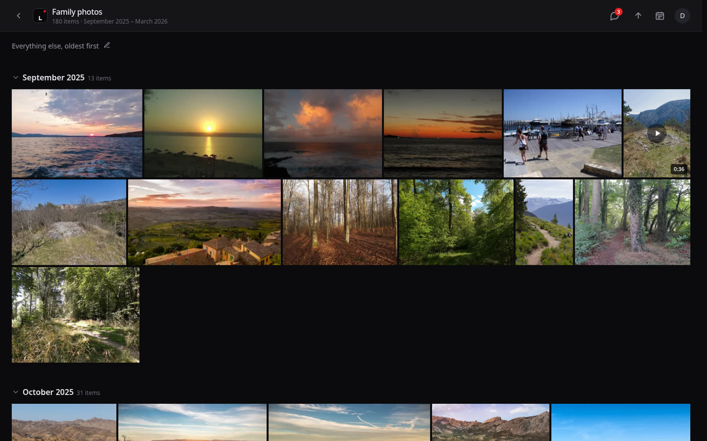
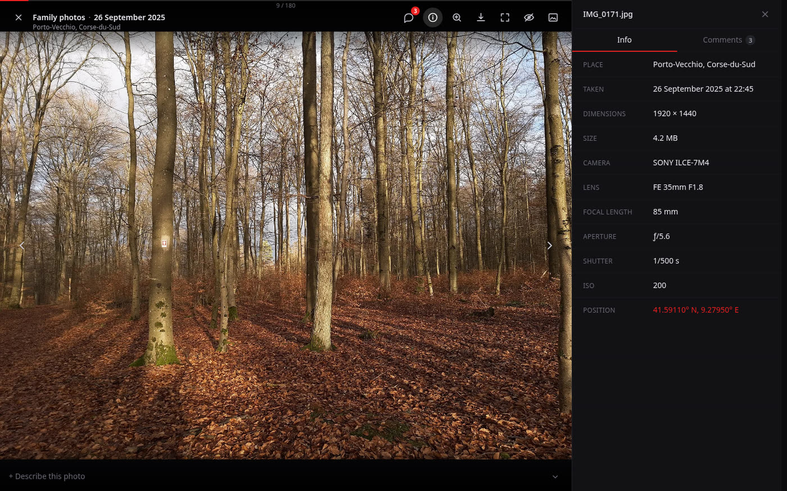
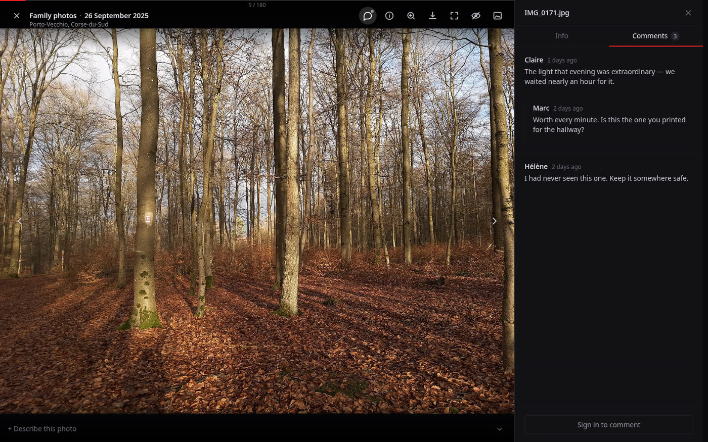
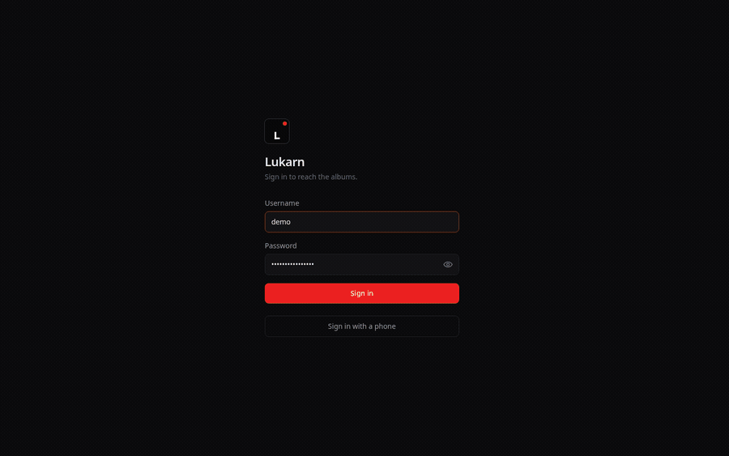

[](https://github.com/cr0cK/lukarn/actions/workflows/verify.yml)
[](./LICENSE)

A self-hosted gallery for browsing photos and videos where they already sit — a
Google Drive account, a folder on the machine, an S3-compatible bucket, a WebDAV
server — in place of the preview each of those offers: justified grid grouped by
month, keyboard-driven fullscreen viewer, light or dark theme.

Access is by username and password, and a credential can be handed to several
people; each person then declares a name and an address in order to comment.
From `/admin`, the owner connects the storages, declares which of their folders
become albums and who may open them — enough to share one album without exposing
the rest of the account.

One instance can read several storages at once, and each album names the one it
belongs to: the gallery is the point, and where the photos happen to sit is not.

| I want to…                              |                                                           |
| --------------------------------------- | --------------------------------------------------------- |
| **Run it, and see my own photos in it** | [**Get started**](#get-started) — five steps, ten minutes |
| Work on the code                        | [Run it from source](#run-it-from-source)                 |
| Put it on a server and keep it running  | [`deploy/README.md`](./deploy/README.md)                  |
| Understand how it is built              | [`specs/README.md`](./specs/README.md)                    |
| Contribute                              | [`CONTRIBUTING.md`](./CONTRIBUTING.md)                    |
| Report a vulnerability                  | [`SECURITY.md`](./SECURITY.md)                            |
| See what changed                        | [`CHANGELOG.md`](./CHANGELOG.md)                          |

## What it looks like



A justified grid, grouped by month or by day. Proportions are known before a single
image loads, so rows are laid out once and never move.



The viewer, and everything the file knows about itself. The place comes from the
photographs of that day, named by reverse geocoding rather than typed in.



A conversation under the photograph, with one level of reply. A credential may be
shared by a household, so each writer declares a name and an address, confirmed by a
code received by email.



Screenshots come from `seed-demo --photos`, on
[public-domain and CC0 photographs](https://commons.wikimedia.org/) — no Drive
account, and nobody's family in a public README.

## What it does

- **Photos and videos**: JPEG, PNG, WebP, HEIC, MP4, MOV. Videos stream with
  native seeking, without transcoding.
- **Accounts and albums administered from the application**, with per-user
  rights, no restart and no file to edit. No sign-up: the owner creates the
  accounts.
- **EXIF**: capture date, camera, lens, aperture, shutter speed, ISO,
  geolocation. Chronological ordering on the real capture date. A day can carry a
  note and a place, the latter derived from coordinates.
- **Per-photo comments**, with one level of reply, and **email notifications**
  for replies and an album's new photos. Every message carries an unsubscribe
  link; administrators can hide and restore comments from `/admin`.
- **Installable on a phone**: added to the home screen, it opens full-screen
  with no address bar and no password to type again.
- **Everything goes through the server**: no Google URL is ever exposed to the
  browser. Thumbnails are generated as WebP and cached on disk.

A storage is only ever read: the Drive scope asked for is read-only, and nothing
is ever written to a folder, a bucket or a WebDAV server.

## Get started

Five steps, from nothing to your own photographs on screen. Nothing to clone and
nothing to compile — the published image carries the application already built.
Docker and — for the walkthrough below — a Google account are the prerequisites,
and about ten minutes.

**This walkthrough connects a Drive**, which is the longest of the four paths:
steps 3 and 4 exist only to give Google an identity to share a folder with. A
bucket, a WebDAV server and a folder on the machine are declared from `/admin` in
one form, with no console to visit — see [Other storages](#other-storages) once
the instance is up.

> The image is built for **`linux/amd64` only**. On arm64 — an Apple Silicon Mac,
> a Raspberry Pi — build it from source instead:
> [`deploy/README.md`](./deploy/README.md).

### 1. Start it

An empty directory holds the whole installation:

```bash
mkdir -p lukarn/config && cd lukarn
```

A `docker-compose.yml` in it:

```yaml
name: lukarn

services:
  app:
    image: ghcr.io/cr0ck/lukarn:latest
    restart: unless-stopped
    ports:
      # Loopback only. Published on every interface, the gallery would answer
      # anyone on the network over plain HTTP — cookies are not `secure` outside
      # https, and a forged X-Forwarded-For from a private address defeats the
      # login backoff. Reaching it from elsewhere goes through a TLS front end.
      - '127.0.0.1:8080:8080'
    env_file: .env
    volumes:
      # The Drive key, when there is one. Read-only: nothing is written here.
      - ./config:/app/config:ro
      # Accounts, index and the encrypted Google token — the only irreplaceable data.
      - lukarn-data:/app/data
      # Generated thumbnails: losing this volume costs a regeneration, nothing more.
      - lukarn-cache:/app/cache

volumes:
  lukarn-data:
    name: lukarn-data
  lukarn-cache:
    name: lukarn-cache
```

A `.env` beside it. The server refuses to start without the two secrets, and
generating them is the whole of the configuration:

```bash
cat > .env <<EOF
PUBLIC_URL=http://localhost:8080
APP_NAME=Photos
SESSION_SECRET=$(openssl rand -hex 32)
TOKEN_KEY=$(openssl rand -hex 32)
EOF
```

Then:

```bash
docker compose up -d
```

`http://localhost:8080` answers. It has no account yet, and no photographs.

### 2. Create your account

```bash
docker compose exec app node packages/server/dist/scripts/create-admin.js alice
```

The password is prompted without being displayed.

**Sign in at `http://localhost:8080`.** That username and password are yours as a
visitor; they have nothing to do with Google. Nobody who opens your gallery will
ever see a Google screen — the application holds one Drive credential, yours, and
serves every photograph through it.

### 3. Give it an identity on Google

The gallery signs in to Google as a **service account**: an identity that owns
nothing, has an address of its own, and sees only what somebody shares with that
address — exactly like a person you would add to a folder. No consent screen, no
"Google hasn't verified this app", and nothing that expires.

In the [Google Cloud console](https://console.cloud.google.com/):

1. **Create a project**, then **APIs & Services → Library**: enable **Google
   Drive API**.
2. **IAM & Admin → Service Accounts → Create.** Give it a name and stop there —
   no role to grant, since it touches nothing in the project.
3. On the account you have just created: **Keys → Add key → Create → JSON**. The
   file downloads once and only once.

Back in the directory from step 1, the key goes in and the `.env` points at it:

```bash
mv ~/Downloads/my-project-1a2b3c.json config/service-account.json
chmod 600 config/service-account.json   # it carries a private key
echo 'GOOGLE_SERVICE_ACCOUNT_FILE=/app/config/service-account.json' >> .env
docker compose up -d                    # re-reads the .env
```

That path is the one **the container sees**: `./config` on your machine is
mounted at `/app/config` inside it.

**Open `/admin`.** The Drive section now shows the account's address, of the form
`lukarn@my-project.iam.gserviceaccount.com`. **Copy it** — the next step is what
gives it something to read.

### 4. Share a folder with that address

In **Google Drive**, right-click the folder holding the photographs →
**Share** → paste the address → leave the role at **Viewer** → untick "Notify
people", since that mailbox does not exist → **Share**.

That share _is_ the access: what you share, the gallery reads; the rest of your
Drive stays invisible to it. And sharing is **inherited**, so one share at the top
of a folder covers every subfolder in it, and every photograph added to it later.

> **The one thing that fails silently.** A folder nobody shared produces no error
> — not in `/admin`, not in the logs. Only an empty album. If an album stays at
> zero items after a sync that reported "ok", check the share before anything
> else.

### 5. Declare the album

Open that same folder in Drive and copy its identifier from the address bar — the
segment after `/folders/`:

```
https://drive.google.com/drive/folders/1AbCdEfGhIjKlMnOpQrStUvWxYz
                                       ^--------- folderId ------^
```

A path (`/Holidays/2026-07-Germany`) will not do: the Drive API only handles
identifiers. That one survives renames and moves.

Then, in **`/admin` → Albums**, create the album: a title, that identifier as the
folder ID, and who may open it. **Synchronisation starts on its own and the
photographs appear within seconds** — indexing downloads nothing, it reads what
Drive already knows about each file.

**That is the install.** Every album after this one is two steps: share its
folder, declare it. They resynchronise on their own at the interval set in
`/admin`, **Resynchronise** forces a pass, and nothing is ever written to Drive.

### Other storages

`/admin` → **Storage** → **Add**. The form asks for what that kind needs and
nothing else, **Test** asks the backend itself and repeats what it answered, and
the album form then offers the new connection. Several may be connected at once.

| Kind                     | What the form asks                                         |
| ------------------------ | ---------------------------------------------------------- |
| **Local folder**         | A subfolder of `STORAGE_LOCAL_ROOT` — see below            |
| **S3-compatible bucket** | Endpoint, region, bucket, and a read-only access key pair  |
| **WebDAV server**        | Address, a folder under it, a username and an app password |

A **Local folder** is the one kind the container has to be given first: mount the
photographs read-only and name their mount point, so that an administrator
password never becomes a way to read the rest of the machine.

```yaml
environment:
  STORAGE_LOCAL_ROOT: /photos
volumes:
  - /home/alice/Pictures:/photos:ro
```

`/admin` then picks a folder **inside** `/photos`, and never an absolute path.

Two differences with a Drive are worth knowing before choosing. A Drive names a
file with an identifier that survives a rename, so a photograph moved between
folders keeps its comments; everywhere else a file is named by its path, and
renaming it makes it a new photograph. And a Drive hands over EXIF data and a
preview inside its listing, where the others hand over bytes — the capture date
is then read from the file itself, and a video's poster is cut by ffmpeg.

### Beyond that

| To…                                   |                                                                                                                                                                                                                             |
| ------------------------------------- | --------------------------------------------------------------------------------------------------------------------------------------------------------------------------------------------------------------------------- |
| Update                                | `docker compose pull && docker compose up -d`                                                                                                                                                                               |
| Decide when to update                 | Replace `latest` with a release number: a `pull` then changes nothing until you raise it                                                                                                                                    |
| Enable comments                       | `SMTP_URL` and `MAIL_FROM` in the `.env` — without a mail server, nobody can confirm their address                                                                                                                          |
| Reach it from a domain, over TLS      | [`deploy/README.md`](./deploy/README.md) — certificate, backups, a machine of its own                                                                                                                                       |
| Put it behind a proxy you already run | `PUBLIC_URL=https://photos.example.com` in the `.env`, proxy to port 8080, and leave the binding on `127.0.0.1` so the proxy is the only way in. Security headers come from the application, so nothing to add on that side |

Every variable, with what it changes:
[`specs/06`](./specs/06-configuration-and-deployment.md).

<details>
<summary>Connecting your own Google account instead, with OAuth</summary>

Nothing to share per album, and that is the whole of its appeal. The price is
paid three times: it grants read access to the **whole** Drive, Google shows its
"hasn't verified this app" screen at every consent, and the refresh token expires
after six months of inactivity — the gallery then quietly stops filling.

`GOOGLE_CLIENT_ID` and `GOOGLE_CLIENT_SECRET` go in the `.env`, the redirect URI
declared in the console must be exactly `PUBLIC_URL` followed by
`/api/oauth/callback`, and consent is given once from `/admin` → **Connect Google
Drive**. Step by step, including the publication status that otherwise expires the
token every seven days:
[`deploy/README.md`](./deploy/README.md#3-give-the-server-access-to-a-storage).

</details>

## Run it from source

For development, or for a machine the published image does not fit. Node ≥ 22 and
pnpm are all that is needed — no Google account, no domain, no server.

```bash
pnpm install
pnpm --filter @lukarn/shared build   # not optional, see below

# .env.example, with the two secrets the server refuses to start without
sed -e "s|^SESSION_SECRET=.*|SESSION_SECRET=$(openssl rand -hex 32)|" \
    -e "s|^TOKEN_KEY=.*|TOKEN_KEY=$(openssl rand -hex 32)|" \
    .env.example > .env

pnpm create-admin alice              # password is prompted
pnpm dev                             # API on :8080, front on :5173
```

**Building `shared` first is not a formality.** `@lukarn/shared` is exposed
through its `dist/`, not its sources: on a fresh clone, `pnpm dev` and
`pnpm create-admin` both fail with `ERR_MODULE_NOT_FOUND` until it has been
built. The same constraint fixes the order of the full build, `shared` → `web` →
`server`.

**Photographs without a Drive account.** `seed-demo` fills albums that already
exist, so declare one from `/admin` first — its Drive folder never has to be
reachable:

```bash
pnpm --filter @lukarn/server seed-demo 300
```

Restart the server afterwards: the disk cache is inventoried only at startup, so
the thumbnails just written stay invisible to a running process.

Before proposing a change, `pnpm verify` — typecheck, lint, formatting, tests and
the documentation checks, the same command CI runs, with nothing to build first.
[`CONTRIBUTING.md`](./CONTRIBUTING.md) has the rest.

### The same, shorter, with just

[`just`](https://github.com/casey/just) is a command runner you install
separately — a package on your system, not a dependency of this repository.
Nothing in the build, the checks or CI uses it: it only saves retyping the
sequences above, each step skipped once it is already done.

| Command             | Does                                                                                                             |
| ------------------- | ---------------------------------------------------------------------------------------------------------------- |
| `just dev`          | `pnpm install`, a `.env` carrying two fresh secrets, the `shared` build, then `pnpm dev` — against your instance |
| `just demo`         | The same against a throwaway instance in `.demo/`, albums declared and seeded, signed in as `demo` / `demo1234`  |
| `just demo-reset`   | Forgets that instance; the next `just demo` rebuilds it                                                          |
| `just admin <name>` | The first administrator of the `./data` instance, password prompted                                              |

`.demo/` holds its own database and its own cache, so nothing there touches the
`./data` you develop against.

<details>
<summary>Keyboard shortcuts — the application shows this list under <code>?</code></summary>

|                |                                     |
| -------------- | ----------------------------------- |
| `← ↑ ↓ →`      | Move around the grid                |
| `Enter`        | Open fullscreen                     |
| `Home` / `End` | First / last photo                  |
| `←` `→`        | Previous / next photo in the viewer |
| `Esc`          | Close                               |
| `F`            | Fullscreen                          |
| `I`            | Information and EXIF                |
| `C`            | Comments                            |
| `D`            | Download the original               |
| `Z`            | Zoom                                |
| `Space`        | Play / pause video                  |
| Swipe          | Previous / next photo, by finger    |
| `?`            | Show this list                      |

</details>

## Architecture

pnpm monorepo, a single container in production — the Fastify server serves both
the API and the built front end.

```
packages/
├─ shared/   Types shared between the API and the front end
├─ server/   Fastify · SQLite · Google Drive · image cache
└─ web/      React · Vite · Tailwind
```

Two choices explain most of the rest. **The index lives in SQLite**, fed by a
walk of the Drive folders that downloads nothing — `files.list` already returns
dimensions and EXIF — so the grid is read locally, and knowing every proportion
in advance lets it lay itself out before a single image loads. And **nothing
reaches the browser from Google**: thumbnails are rendered to WebP and cached on
disk with LRU eviction, videos are relayed `Range` by `Range` without
transcoding.

Why it is built this way is in [`specs/`](./specs/) — start with
[`specs/README.md`](./specs/README.md).

## Security

- Passwords hashed with argon2id, login attempts rate-limited with progressive
  backoff, sessions in the database and revocable immediately.
- **A forbidden album answers 404, never 403**: its existence is not observable.
  Every media access checks the album it belongs to.
- The Google refresh token is encrypted with AES-256-GCM under a key derived from
  `TOKEN_KEY`, which is absent from the database.
- **Security headers come from the application**, not from the proxy — CSP with
  `script-src 'self'`, so a `<script>` slipped into an album title or a comment
  does not execute. They hold in development and behind an unconfigured front end
  as well.

Details in [`specs/04`](./specs/04-security-and-access.md). Found a hole? Please
report it privately — [`SECURITY.md`](./SECURITY.md) says how, and what counts.

## The name

_Lukarn_ is Gothic for a lantern — the thing you pick up to go and look in the
dark. It is also the word the linguists put forward, next to Irish _luacharn_,
when they argued that French _lucarne_ came from Latin _lucerna_: the small
opening in a roof that lets the light in and lets you see inside. Either reading
suits an application whose whole job is to open one window onto photos that would
otherwise stay in the dark of someone else's storage. The mark keeps both: its
dot sits high and to the right, where a dormer sits in a roof, and where the
shutter release sits under a thumb.

## License

[AGPL-3.0-only](./LICENSE) — Copyright (C) 2026 Alexis Mineaud.

Run it, study it, change it, pass it on. The one obligation worth knowing: if you
deploy a modified version and let anyone reach it over a network, section 13
requires you to offer those users the source of _your_ version. Running it
unmodified for your family asks nothing of you.

Lukarn is not affiliated with, endorsed by, or sponsored by Google LLC. Google
Drive is a trademark of Google LLC, named here only to say which service the
application reads.
