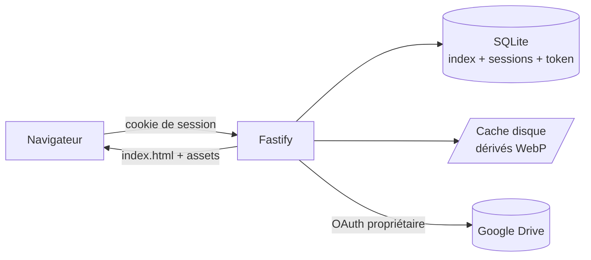
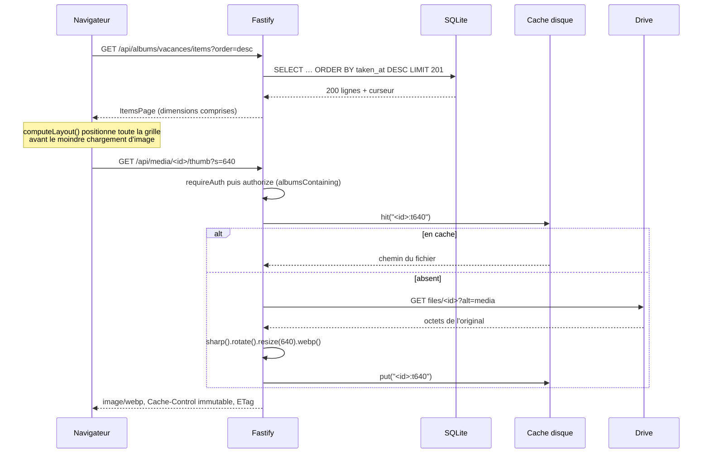

# 02 — Architecture

## Vue d'ensemble

Monorepo pnpm, trois packages, un seul conteneur en production. Le serveur
Fastify sert à la fois l'API sous `/api` et le front buildé sur tout le reste.

| Package           | Rôle                                                                                                                                                                                                                                |
| ----------------- | ----------------------------------------------------------------------------------------------------------------------------------------------------------------------------------------------------------------------------------- |
| `packages/shared` | Types du contrat d'API (`MediaItem`, `Album`, `ItemsPage`, `AdminStatus`…) et les quelques constantes partagées (`THUMB_SIZES`, `SortOrder`). Aucune dépendance, aucune logique. Le front ne redéclare jamais une forme de réponse. |
| `packages/server` | Fastify 5, better-sqlite3, sharp, `@googleapis/drive`. Détient l'index, la connexion Drive, le pipeline média, les sessions.                                                                                                        |
| `packages/web`    | React 19, Vite, Tailwind 4, TanStack Query, React Router. Aucun accès direct à Google.                                                                                                                                              |

### Le serveur, fichier par fichier

| Fichier                 | Responsabilité                                                                                      |
| ----------------------- | --------------------------------------------------------------------------------------------------- |
| `src/main.ts`           | Point d'entrée : `.env`, env, `buildApp`, minuteurs reprogrammables, arrêt gracieux.                |
| `src/app.ts`            | Assemblage Fastify : plugins, préfixes de routes, service du front, gestionnaire d'erreurs.         |
| `src/env.ts`            | Schéma zod des variables d'environnement, résolution des chemins.                                   |
| `src/config.ts`         | Schéma zod d'`albums.yaml`, lu au seul amorçage d'une base vide.                                    |
| `src/bootstrap.ts`      | Import unique d'`albums.yaml` en base, tant qu'aucun compte n'existe.                               |
| `src/config-repo.ts`    | `ConfigRepo` : comptes, albums, droits, réglages. Seul écrivain, instantané mémoire.                |
| `src/context.ts`        | `AppContext` : objet unique qui porte config, base et services. Les routes n'instancient rien.      |
| `src/db.ts`             | Ouverture SQLite, pragmas, tableau `MIGRATIONS`.                                                    |
| `src/repo.ts`           | Accès aux tables `media` et `sync_state`, curseurs de pagination.                                   |
| `src/comments.ts`       | `CommentRepo` : fils, profondeur limitée à un niveau, modération.                                   |
| `src/commenters.ts`     | `CommenterRepo` : identités de commentateur, vérification de l'adresse par code, destinataires.     |
| `src/mail.ts`           | Transport SMTP, file d'envoi hors requête, composition des emails de notification.                  |
| `src/sessions.ts`       | Création, lecture, destruction et purge des sessions.                                               |
| `src/crypto.ts`         | AES-256-GCM pour le refresh token, comparaison en temps constant.                                   |
| `src/throttle.ts`       | Backoff progressif des tentatives de connexion, en mémoire.                                         |
| `src/drive/service.ts`  | Unique connexion OAuth : consentement, refresh, `files.list`, `fetchFile`, détection de révocation. |
| `src/drive/sync.ts`     | Parcours des dossiers et remplissage de l'index.                                                    |
| `src/drive/metadata.ts` | Normalisation des champs Drive (types MIME, date EXIF, nombres, coordonnées).                       |
| `src/media/renderer.ts` | Rendu WebP par sharp, déduplication des rendus concurrents, repli sur la vignette Drive.            |
| `src/media/cache.ts`    | Cache disque avec inventaire en mémoire et éviction LRU.                                            |
| `src/media/range.ts`    | Validation du header `Range` avant relais.                                                          |
| `src/plugins/auth.ts`   | Résolution de la session à chaque requête, gardes `requireAuth` / `requireAdmin`.                   |
| `src/routes/*.ts`       | Les quatre familles de routes — voir [05](./05-api.md).                                             |

## Cheminement d'une vignette

Du clic sur un album jusqu'à l'octet rendu.

Points qui comptent :

- Le contrôle d'accès est un `preHandler` global sur le préfixe `/media`
  (`routes/media.ts`) : aucune route média ne peut l'oublier.
- La déduplication vit dans `MediaRenderer.inFlight` : une grille qui s'ouvre
  demande des dizaines de vignettes, mais chaque fichier n'est téléchargé qu'une
  fois même si dix requêtes arrivent ensemble.
- **Les rendus de fichiers _différents_ sont bridés** par un limiteur
  (`media/semaphore.ts`), dimensionné à `cpus - 2` et borné entre 2 et 4. La
  place est prise avant le téléchargement, parce que c'est l'original chargé en
  mémoire qui pèse : sans cette limite, vingt-quatre rendus simultanés font
  grimper le processus de plus de 300 Mo. Le débit total est inchangé, c'est la
  mémoire qui est divisée par trois (D32).
- Le décodage se fait **hors du fil principal**, mais sur le pool de fils de
  libuv, partagé avec les lectures de fichiers. D'où `threadpool.ts`, importé en
  premier par `main.ts` : à la taille par défaut de quatre, servir une vignette
  déjà en cache attend deux secondes derrière les rendus en cours.
- L'`ETag` vaut `"<mediaId>-<variante>"`, la variante étant `320`/`640`/`1280`,
  `full` ou `hd`. Un `If-None-Match` correspondant répond 304 sans toucher au
  disque.
- Les vidéos n'ont pas de rendu : `serveRendered` répond **415** si
  `kind !== 'photo'`. La grille affiche une tuile sobre avec la durée.

## Cheminement d'une synchronisation

Déclenchée au démarrage (`sync.onStartup`), périodiquement
(`sync.intervalMinutes`), après un consentement OAuth réussi, ou depuis
`POST /api/admin/resync`.

1. `Syncer.sync(album)` — si une sync du même album tourne déjà **avec la même
   configuration effective** (`folderId` et `recursive`), la promesse en cours
   est renvoyée telle quelle : une resync manuelle ne double jamais le travail.
   Si la configuration a changé entre-temps, une nouvelle sync est enchaînée
   derrière la précédente. Partager la promesse de l'ancienne rendrait à
   l'appelant un travail qui repeuple l'album avec le dossier qu'il vient de
   quitter ; les lancer en parallèle laisserait l'ordre d'arrivée des
   `deleteStale` décider du contenu final.
2. `sync_state` passe à `running`, erreur remise à `null`.
3. Un `seenAt` ISO est figé : c'est l'estampille du passage.
4. Parcours en profondeur depuis `folderId`, avec `visited` contre les cycles et
   un plafond `MAX_FOLDERS = 5000`. `recursive: false` n'empile pas les
   sous-dossiers. Les **raccourcis Drive ne sont pas suivis** : `files.list` ne
   demande pas `shortcutDetails`, si bien qu'un dossier atteignable seulement
   par un raccourci n'est jamais indexé. `visited` sert donc au cas où le même
   dossier est atteint par deux chemins, pas à casser un cycle de raccourcis.
5. `files.list` par pages de 1000, en ne demandant que
   `id, name, mimeType, size, modifiedTime, md5Checksum, imageMediaMetadata,
videoMediaMetadata`. **Aucun contenu n'est téléchargé.**
6. `toUpsert` normalise : `classify` écarte tout ce qui n'est ni image ni vidéo,
   `parseExifTime` lit `YYYY:MM:DD HH:MM:SS`, et les dimensions sont inversées
   quand `imageMediaMetadata.rotation` est impair — sinon les portraits
   casseraient la mise en page.
7. Écriture par lots de 500 dans une transaction. L'album devient consultable
   pendant la sync.
8. `deleteStale(albumId, seenAt)` retire ce qui n'a pas été revu — fichier
   déplacé, supprimé ou mis à la corbeille.
9. `sync_state` passe à `ok`. En cas d'échec, le statut passe à `error` avec le
   message, **mais `lastSyncAt` garde la valeur de la dernière sync réussie** :
   /admin annonce ainsi le dernier passage vraiment complet. Attention à ce que
   cela ne dit **pas** : l'index n'est pas revenu en arrière. Les lots déjà
   écrits sont validés, `deleteStale` n'a pas eu lieu, donc l'index mélange
   l'ancien et le nouveau contenu. Il reste cohérent — tout ce qui a été écrit
   existe bien dans Drive — simplement incomplet (voir [08](./08-decisions.md),
   D27).
10. `syncAll` enchaîne les albums **séquentiellement** pour ménager le quota, et
    s'arrête net sur `DriveRevokedError` — les suivants échoueraient de la même
    façon.

## Les choix structurants, et leur raison

**Index SQLite plutôt qu'appels Drive à la volée.** Une grille de 200 vignettes
qui interrogerait Drive à chaque défilement consommerait le quota et
ajouterait 200 à 400 ms de latence à chaque page. L'index local rend la
pagination instantanée, permet de trier sur la date EXIF (que Drive ne sait pas
trier) et laisse l'application fonctionner en lecture même quand Drive est
injoignable ou l'autorisation révoquée — seuls les rendus non encore en cache
échouent alors.

**Proxy média plutôt que redirection vers Google.** Servir des liens Google
signés serait moins coûteux en bande passante, mais : un lien signé fuit hors du
contrôle d'accès dès qu'il est copié, il expire et casse le cache navigateur, et
il exposerait l'arborescence Drive au visiteur. Tout passe donc par
`/api/media/...`, où chaque requête revérifie l'autorisation.

**Cache disque des dérivés.** Régénérer une vignette coûte un téléchargement
Drive plus un décodage sharp. Le cache est un simple fichier par entrée, clé
`sha256(<fileId>:<md5>:<variante>)` — sans le `<md5>` pour les rares fichiers
que Drive n'empreinte pas — répartie sur 256 sous-dossiers, inventaire des
tailles en mémoire pour décider des évictions sans re-parcourir l'arborescence.
L'inventaire est **reconstruit au démarrage** par `MediaCache.load()` : un
fichier déposé pendant que le serveur tourne est ignoré jusqu'au redémarrage
(c'est le piège du script `seed-demo`).

L'éviction tourne en tâche de fond, sans que l'écriture qui l'a déclenchée
l'attende. Deux précautions y sont indispensables :

- **Chaque candidat est revérifié juste avant sa suppression.** L'ordre est figé
  au début de la passe, mais `rm` rend la main à la boucle d'événements : une
  requête peut servir une entrée entre le tri et sa suppression. Une estampille
  d'accès strictement croissante, portée par chaque entrée, révèle ce cas ;
  l'entrée touchée est épargnée. Sans cela, `createReadStream` recevrait un
  `ENOENT` sur une entrée que `hit()` venait de valider.
- **Un `rm` en échec est journalisé, pas propagé.** Un rejet non géré en tâche de
  fond termine le process Node : toute la galerie tomberait parce qu'un fichier
  de cache n'a pas pu être supprimé (volume en lecture seule, erreur d'E/S).
  L'entrée reste inventoriée, puisque son fichier est toujours là, et la passe
  continue avec les suivantes.

Côté lecture, `MediaRenderer.render()` vérifie que le fichier désigné par
l'inventaire existe encore avant de le rendre ; sinon il refabrique le dérivé.
C'est ce qui couvre « vider le cache » depuis /admin pendant qu'une grille se
charge, et tout ménage manuel sur le volume.

Limite connue, assumée : la revérification a lieu **avant** le `rm`, pas après.
Une requête peut donc valider une entrée pendant qu'une suppression est déjà en
vol et recevoir un `ENOENT` à l'ouverture — de même qu'un `clear()` déclenché
depuis /admin pendant une écriture. Fermer complètement la fenêtre demanderait
des baux ou un compteur de références sur chaque entrée, ce qui coûte plus cher
en complexité permanente qu'une vignette manquante ne coûte à qui la recharge.

**Pas de transcodage vidéo.** `GET /api/media/:id/original` relaie le header
`Range` tel quel vers Drive et recopie `Content-Length` / `Content-Range` de la
réponse. Le seek natif marche, le CPU du VPS ne fait rien, et il n'y a aucun
format intermédiaire à stocker. Les statuts `206` **et `416`** sont relayés :
une plage insatisfaisable fait partie du protocole `Range` normal (offset au-delà
de la fin, courant quand on change de vidéo), et son `Content-Range` dit au
lecteur où s'arrête le fichier. La contrepartie assumée : un format que le
navigateur ne lit pas n'est pas lisible du tout.

**Le cache se remplit sans attendre qu'on clique.** `media/prewarm.ts` rend la
variante `full` des photos en fond, des plus récentes aux plus anciennes : une
photo jamais ouverte coûte sinon ~3,5 s au premier clic — deux secondes de
téléchargement Drive, une et demie de décodage et d'encodage — contre 5 ms
depuis le cache. Il est branché sur le ménage horaire de `main.ts` et sur le
démarrage, jamais sur la fin d'une synchronisation : celle-ci peut être
désactivée, et le cache attendrait alors un clic pour se remplir. Réglage
`prewarmCache`, relu à chaque photo. Sa lenteur est volontaire — voir D45 pour
les trois garde-fous.

**Un original de plus de 80 Mo n'est pas décodé sur place.** Le limiteur borne
le nombre de rendus simultanés, pas leur taille, et chaque rendu charge son
original entier en mémoire pour le donner à sharp : trois places prises par des
fichiers de 300 Mo suffisent à emporter le processus, donc la galerie. La taille
annoncée par Drive est donc contrôlée **avant** de lire le corps, et le corps
mesuré à son tour — un en-tête absent ou menteur ne doit pas suffire. Au-delà,
la photo n'est pas refusée : elle emprunte le repli ci-dessous.

**Le repli Drive est authentifié.** Quand libvips ne décode pas un HEIC ou un
RAW, ou quand l'original est trop lourd, le rendu repart du `thumbnailLink`
produit par Google. Ce lien porte le même
contrôle d'accès que le fichier : demandé sans en-tête `Authorization`, il répond
401/403 pour tout fichier non public — c'est-à-dire dans le cas normal. Il passe
donc par `DriveService.fetchAuthorized()`, comme les téléchargements d'originaux,
avec le même renouvellement de jeton sur 401.

**Un seul conteneur.** Le front buildé est servi par `@fastify/static` depuis le
même process. Une seule origine, donc des cookies de session simples, aucun CORS,
aucun reverse-proxy interne à configurer.
