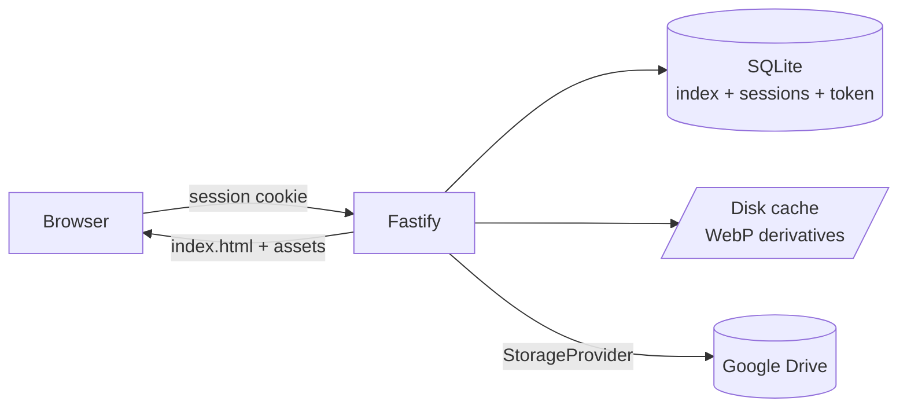
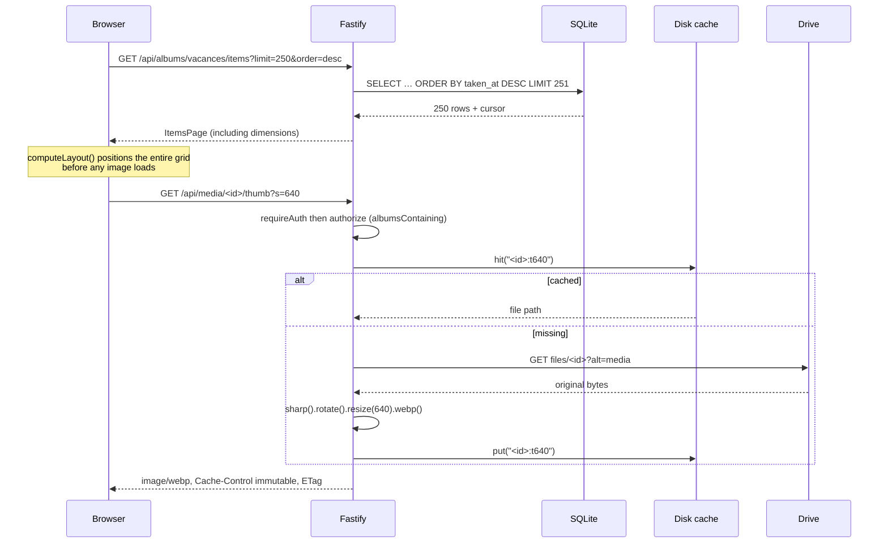

# 02 — Architecture

## Overview

A pnpm monorepo, three packages, and a single container in production. The
Fastify server serves both the API under `/api` and the built frontend for
everything else.

| Package           | Role                                                                                                                                                                                                         |
| ----------------- | ------------------------------------------------------------------------------------------------------------------------------------------------------------------------------------------------------------ |
| `packages/shared` | API contract types (`MediaItem`, `Album`, `ItemsPage`, `AdminStatus`…) and the few shared constants (`THUMB_SIZES`, `SortOrder`). No dependencies, no logic. The frontend never redeclares a response shape. |
| `packages/server` | Fastify 5, better-sqlite3, sharp, `@googleapis/drive`. Owns the index, the storage connection, media pipeline, and sessions.                                                                                 |
| `packages/web`    | React 19, Vite, Tailwind 4, TanStack Query, React Router. No direct access to Google.                                                                                                                        |

### The server, file by file

| File                         | Responsibility                                                                                                                                                                       |
| ---------------------------- | ------------------------------------------------------------------------------------------------------------------------------------------------------------------------------------ |
| `src/main.ts`                | Entry point: `.env`, env, `buildApp`, reschedulable timers, graceful shutdown.                                                                                                       |
| `src/app.ts`                 | Fastify assembly: plugins, route prefixes, frontend serving, error handler.                                                                                                          |
| `src/env.ts`                 | zod schema for environment variables, path resolution.                                                                                                                               |
| `src/config.ts`              | zod schema for `albums.yaml`, read only when bootstrapping an empty database.                                                                                                        |
| `src/bootstrap.ts`           | One-time import of `albums.yaml` into the database, while no account exists.                                                                                                         |
| `src/config-repo.ts`         | `ConfigRepo`: accounts, albums, permissions, settings. Sole writer, in-memory snapshot.                                                                                              |
| `src/context.ts`             | `AppContext`: single object carrying config, database, and services. Routes instantiate nothing.                                                                                     |
| `src/db.ts`                  | Opens SQLite, sets pragmas, holds the `MIGRATIONS` array.                                                                                                                            |
| `src/repo.ts`                | Access to the `media` and `sync_state` tables, pagination cursors.                                                                                                                   |
| `src/comments.ts`            | `CommentRepo`: threads limited to one level of depth, moderation.                                                                                                                    |
| `src/places.ts`              | `AlbumDayRepo` and `PlacesPass`: annotated days, clustering of EXIF positions.                                                                                                       |
| `src/geocoder.ts`            | Rate-limited Nominatim reverse geocoding, cached by cells of roughly one kilometre.                                                                                                  |
| `src/commenters.ts`          | `CommenterRepo`: commenter identities, code-based address verification, recipients.                                                                                                  |
| `src/mail.ts`                | SMTP transport, out-of-request sending queue, notification email composition.                                                                                                        |
| `src/sessions.ts`            | Session creation, reading, destruction, and purging.                                                                                                                                 |
| `src/crypto.ts`              | AES-256-GCM for the refresh token, constant-time comparison.                                                                                                                         |
| `src/throttle.ts`            | Progressive in-memory backoff for login attempts.                                                                                                                                    |
| `src/storage/provider.ts`    | `StorageProvider`: the three operations a backend owes the indexer and the media proxy, the shape of a listed entry, and the error taxonomy every backend maps onto.                 |
| `src/storage/connections.ts` | `StorageConnectionRepo`: the connections table, its secrets through `crypto.ts`, and an in-memory snapshot. Sole writer.                                                             |
| `src/storage/registry.ts`    | `StorageRegistry`: turns a connection row into a live `StorageProvider`, one cached per connection and dropped on any write.                                                         |
| `src/storage/drive.ts`       | Google Drive behind that interface: consent, refresh, revocation detection, and the mapping from `Schema$File` to `StorageEntry`. The only file importing `@googleapis/*`.           |
| `src/storage/local.ts`       | `LocalFolderService`: a folder on the machine behind that interface, fenced to `STORAGE_LOCAL_ROOT` by `realpath` on every path it resolves, and building its own `Range` responses. |
| `src/storage/xml.ts`         | The element reader S3 listings and WebDAV `PROPFIND` replies share. Reads names and text; expands no doctype and no external entity, deliberately.                                   |
| `src/storage/sigv4.ts`       | AWS Signature Version 4 over `node:crypto`: a request description and a key pair in, headers out. Pure, so the published AWS vectors run against it (D260816e).                      |
| `src/storage/s3.ts`          | An S3-compatible bucket behind the interface: `ListObjectsV2` for `list()`, a signed ranged `GET` for `fetch()`, and no preview. Adds no dependency.                                 |
| `src/sync/sync.ts`           | Container traversal and index population, driven by a `StorageProvider`.                                                                                                             |
| `src/sync/metadata.ts`       | Normalisation shared by every backend (MIME types, EXIF date, numbers, coordinates), video capture date, and the identifier derived for a path-based backend.                        |
| `src/sync/mp4.ts`            | Windowed reading of an MP4 container header: where its `moov` is, which date its `mvhd` holds, and which codec its video track uses.                                                 |
| `src/sync/exif.ts`           | Locating the EXIF block in the first bytes of a photograph: a JPEG's `APP1` marker, and a HEIC's `meta → iinf → iloc` indirection. Pure, and never reaches the network.              |
| `src/media/renderer.ts`      | WebP rendering with sharp, concurrent-render deduplication, fallback to the preview the backend holds. `prepare` prepares several variants from one download for prewarming.         |
| `src/media/cache.ts`         | Disk cache with an in-memory inventory and LRU eviction. Two instances: image derivatives and prepared video storage.                                                                |
| `src/media/transcode.ts`     | `VideoTranscoder` and `TranscodePass`: background H.264 versions of videos whose codec no common browser decodes, one at a time.                                                     |
| `src/media/range.ts`         | Validation of the `Range` header before relaying it.                                                                                                                                 |
| `src/plugins/auth.ts`        | Session resolution on every request, `requireAuth` / `requireAdmin` guards.                                                                                                          |
| `src/plugins/headers.ts`     | Security headers applied to every response — see [04](./04-security-and-access.md).                                                                                                  |
| `src/routes/*.ts`            | The four route families — see [05](./05-api.md).                                                                                                                                     |

## The storage interface

Everything the application does with photos happens on its own index, its own
cache and its own renderer. **Three operations actually reach the storage**, and
`StorageProvider` (`storage/provider.ts`) is exactly those three:

| Operation                     | Who calls it                          | What it answers                                    |
| ----------------------------- | ------------------------------------- | -------------------------------------------------- |
| `list(container, cursor)`     | `sync/sync.ts`, during indexing       | One page of `StorageEntry`, folders included       |
| `fetch(ref, range?, signal?)` | the renderer, transcoder, `/original` | Bytes, with the browser's `Range` relayed verbatim |
| `preview(ref, edge)`          | the renderer, as a fallback           | A preview the backend already holds, or `null`     |

Plus `probe()`, which answers /admin, and `guard()`, which runs an operation and
translates the backend's failures into the shared taxonomy —
`StorageNotConnectedError`, `StorageKeyMismatchError`,
`StorageNotConfiguredError`, `StorageRevokedError`, `StorageUnavailableError`.
The **caller** wraps: an authorisation may be withdrawn between the moment a call
is prepared and the moment it fails, and only the caller knows which unit of work
has to be abandoned as a result.

A `StorageEntry` is what indexing consumes: a backend-native `ref`, a name, a
`folder` flag, a `version` — whatever the backend guarantees changes with the
bytes — and `media`, the metadata the backend already holds. **`media` is `null`
when it holds none**, and `preview()` returns `null` for the same reason. Both
nulls describe Drive's privilege rather than a defect: `files.list` returns EXIF
data and a `thumbnailLink` in the listing itself, which is what makes indexing
free of downloads (D3) and gives HEIC, RAW and video their only preview (D92).

Google Drive (`storage/drive.ts`) is the only file that imports `@googleapis/*`,
and a **local folder** (`storage/local.ts`) is the second implementation.
Nothing downstream — the index, the disk cache, the renderer, the justified grid —
knows where a file lives.

A folder is the backend that holds neither of the two things Drive holds, which is
what makes it the proof the interface fits more than Drive:

| What Drive supplies    | What a folder supplies                                                                              |
| ---------------------- | --------------------------------------------------------------------------------------------------- |
| `imageMediaMetadata`   | `media: null` — the indexer reads the bytes                                                         |
| `thumbnailLink`        | `preview()` returns `null` — the renderer decodes, and ffmpeg cuts a video's poster (D260816)       |
| `md5Checksum`          | `version` is `size:mtimeMs`, the pair the filesystem guarantees moves when the bytes do             |
| An id surviving a move | `refKind: 'path'` — the reference **is** the location, so a rename produces a new file to the index |

It also answers `Range` itself rather than relaying an upstream answer: 206 with a
`Content-Range`, 416 with `bytes */size` when the interval names nothing, 200
otherwise, from a `createReadStream` turned into a `Response`. That is precisely
the shape `routes/media.ts` already relays, so the media proxy has no branch for it.

**Which folder it may read is declared by the environment, not by /admin.**
`STORAGE_LOCAL_ROOT` names one directory; a connection chooses a subpath under it,
and every path resolved goes through `realpath` before being checked to still sit
under that root — a symlink leading out of the tree is refused rather than followed
(D260816d, and [04](./04-security-and-access.md)).
`storage/s3.ts` is an S3-compatible bucket — MinIO,
Garage, Ceph, Backblaze and Amazon alike — and adds **no dependency at all**: its
requests are signed by `storage/sigv4.ts` and its listings read by
`storage/xml.ts` (D260816e).

A backend also declares **how it names a file**, which is what decides the
identifier the index stores. Drive's `refKind` is `identity`: a file id survives a
rename, which is what keeps a comment attached to a photo dragged into another
folder. A bucket's is `path`, because an object key _is_ its location — two
connections may hold the same one, and renaming an object gives it another. The
index hashes the key with the connection and keeps the location in
`media.source_path`, the only form `fetch` understands.

Three properties of the S3 implementation are worth knowing before changing it:

- **`delimiter=/` is what turns a flat key space into folders.** Keys sharing a
  segment collapse into `<CommonPrefixes>`, which is the only reason a recursive
  album does not read every object in the bucket to find its subfolders.
- **The browser's `Range` is signed, not merely forwarded.** A bucket verifies
  every header named in `SignedHeaders`, so a byte range left out of it — or
  signed as a different value — is refused outright, and the symptom is a video
  that will not seek on exactly the large files seeking exists for.
- **A listing carries no content type**, so the MIME type comes from the
  extension, and the table of extensions is also the filter: anything absent is
  not indexed. RAW is deliberately absent — no backend but Drive holds a preview
  for one, and a grid of tiles that can never load is worse than an album that
  says a bucket held nothing it could show.

**An instance reads several storages, and an album names one.** Each is a row of
`storage_connections`; `StorageRegistry` builds a provider from it and caches one
per connection, because a provider is not stateless — a `DriveService` holds an
authorised client whose access token it renews, and rebuilding one per request
would exchange a refresh token for every thumbnail. The cache is dropped whenever
the rows change, which is what makes a reconnection take effect without a restart.

Everything that reaches a storage therefore starts from a connection id: the
syncer resolves the album's, `getFileMeta` returns the one holding a file, and the
renderer and transcoder take a provider per call rather than holding one
(D260815g).

## Thumbnail flow

From clicking an album to the rendered byte.

Key points:

- Access control is a global `preHandler` on the `/media` prefix
  (`routes/media.ts`): no media route can forget it.
- Deduplication lives in `MediaRenderer.inFlight`, indexed by **variant key**
  rather than by file: ten requests for the same thumbnail trigger only one
  download, but ten requests split between `s=320` and `s=640` for the same file
  trigger **two**. This is the accepted cost of a rendering path that knows only
  one variant at a time. `MediaRenderer.prepare` — the prewarming path — **does
  not go through `inFlight`**: it guarantees a single download in a different
  way, through one fetch for all variants under one limiter slot.
- **Renders of _different_ files are throttled** by a limiter
  (`media/semaphore.ts`), sized to `cpus - 2` and bounded between 2 and 4. The
  slot is acquired before the download because the original loaded into memory
  is the expensive part: without this limit, twenty-four simultaneous renders
  increase the process by more than 300 MB. Total throughput is unchanged, while
  memory use is divided by three (D32).
- Decoding happens **off the main thread**, but on libuv's thread pool, shared
  with file reads. This is why `threadpool.ts` is imported first by `main.ts`:
  with the default size of four, serving an already cached thumbnail waits two
  seconds behind in-progress renders.
- The `ETag` is `"<mediaId>-<version>-<variant>"`, where the variant is
  `320`/`640`/`1280`, `full`, or `hd`. A matching `If-None-Match` returns 304
  without touching the disk. **The `version` segment is not decorative**: it is
  the content fingerprint, and because the derivative is served as `immutable`
  for a year, it is the only thing that invalidates the browser cache when a
  Drive file is replaced under the same identifier.
- **A video has a thumbnail, never a full-screen render.** `serveRendered`
  renders it from the Drive preview (`render(..., 'poster')`), bypassing the
  original download: no video bytes are decoded here (D92). Exactly two cases
  still return 415: `full` or `hd` for a video — there is nothing to enlarge —, and `thumb`
  for a video whose `has_thumbnail` is 0, because Drive has no image to provide.
  The grid then retains the understated tile, and the play badge with its duration
  in every case.

## Synchronisation flow

Triggered at startup (`sync.onStartup`), periodically (`sync.intervalMinutes`),
after successful OAuth consent, from `POST /api/admin/resync`, **when an album is
created**, and **when its scope changes** (`folderId` or `recursive` is
changed: the album index is then purged and rebuilt). The last two go through
`startSync` (`routes/admin.ts`) — this is the "I create an album and open it
straight away" path, the most common one during installation.

All these triggers go through `AppContext.syncThenPrewarm`: indexing is followed
by thumbnail prewarming (D58), then preparation of unplayable videos (D260809b).
The order matters — thumbnails keep someone waiting in front of the grid, while
transcoding prepares a video that nobody is watching yet.

1. `Syncer.sync(album)` — if a sync of the same album is already running **with
   the same effective configuration** (`folderId` and `recursive`), its pending
   promise is returned unchanged: a manual resync never duplicates the work. If
   the configuration has changed in the meantime, a new sync is queued after the
   previous one. Sharing the old promise would return work to the caller that
   repopulates the album from the folder it has just left; running them in
   parallel would let the arrival order of `deleteStale` calls determine the final
   content.
2. `sync_state` changes to `running`, and the error is reset to `null`.
3. An ISO `seenAt` is fixed: this is the pass timestamp.
4. Depth-first traversal from `folderId`, with `visited` guarding against cycles
   and a `MAX_FOLDERS = 5000` limit. `recursive: false` does not enqueue
   subfolders. **Drive shortcuts are not followed**: `files.list` does not request
   `shortcutDetails`, so a folder reachable only through a shortcut is never
   indexed. `visited` therefore handles cases where two paths reach the same
   folder, rather than breaking shortcut cycles.
5. `provider.list(container, cursor)` in pages, until the cursor comes back
   `null`. For Drive that is `files.list` in pages of 1000, requesting only
   `id, name, mimeType, size, modifiedTime, md5Checksum, hasThumbnail,
imageMediaMetadata, videoMediaMetadata`, and the cursor is its `nextPageToken`,
   opaque to the traversal. **No content is downloaded.** `hasThumbnail` becomes
   `StorageEntry.hasPreview`: whether the backend has produced a preview of the
   file, which is what allows a video to have a grid thumbnail (D92) and avoids
   asking again on every page load when none exists.
6. `toUpsert` reads a `StorageEntry`, never a Drive field: `classify` excludes
   anything that is neither an image nor a video, and dimensions are swapped when
   `media.rotated` is set — otherwise portraits would break the layout. The
   backend-specific part happens earlier, in the provider: `storage/drive.ts` is
   where `imageMediaMetadata.time` goes through `parseExifTime` and `rotation`
   becomes `rotated`.
7. **A photograph whose backend supplies no metadata is read from its own bytes.**
   `StorageEntry.media` is `null` for everything except Drive, and capture date,
   camera, ISO and position then come from the EXIF block — which sits at the
   **front** of both formats that carry one, so a single 64 KB window reaches it.
   `sync/exif.ts` locates it: the `APP1` marker for a JPEG, and for a HEIC the
   `meta → iinf → iloc` indirection that stores EXIF as an addressed item.
   `fromExifBlock` in `sync/metadata.ts` turns it into the same
   `ProviderMediaMetadata` Drive delivers pre-parsed, so nothing downstream learns
   which backend a photograph came from. **One window per new photograph and none
   afterwards**: `MediaRepo.indexedMedia` returns what the last pass read, and
   while the version the backend reports is unchanged the bytes are unchanged. A
   file with no EXIF — a screenshot, a re-encoded photograph — is the ordinary
   case and falls back to `modifiedTime`, exactly as before. See
   [D260816b](./08-decisions/D260816b-exif-is-read-from-a-64-kb-window-not-from-the-file.md).
8. **A video is the only exception to "no content is downloaded"**: no backend
   exposes a capture date for it, so the beginning of its file is read through
   `Range` requests (D97). `sync/mp4.ts` follows the chain of top-level boxes from offset
   0 to reach the `moov`, whose `mvhd` contains the recording date;
   `resolveVideoTakenAt` compares it with the timestamp in the file name. **The
   same window provides the video-track codec** — `readVideoCodec` descends
   `moov → trak → mdia → minf → stbl → stsd` and retains the first track whose
   `hdlr` is `vide` (D260809b): both reads share the box, so separating them would
   double the number of requests needed to reread the same bytes. At most **four
   64 KB windows** per video, 2.3 on average in a real import, and **none** for an
   already dated video whose `md5` has not changed **and whose codec is set** —
   this is what `MediaRepo.fileTakenAt` checks before reading anything. This last
   condition populates `video_codec` without a backfill: rows predating migration
   14 are reread once, then bypassed like the others. A read failure does not fail
   the sync: the date falls back to the file name, then to `modifiedTime`, and the
   codec remains `NULL`, so it is retried.
9. Rows are written in batches of 500 within a transaction. The album becomes
   available during the sync.
10. `deleteStale(albumId, seenAt)` removes anything not seen again — a file that
    was moved, deleted, or moved to the bin.
11. `sync_state` changes to `ok`. On failure, the status changes to `error` with
    the message, **but `lastSyncAt` retains the value of the last successful
    sync**: /admin therefore reports the last genuinely complete pass. Note what
    this does **not** mean: the index has not been rolled back. Batches already
    written are committed and `deleteStale` has not run, so the index contains a
    mixture of old and new content. It remains consistent — everything written
    does exist in the storage — but is simply incomplete (see
    [D27](./08-decisions/D27-an-interrupted-sync-leaves-a-mixed-index-and-that-is.md)).
12. `syncAll` processes albums **sequentially** to preserve the quota, and stops
    immediately on `StorageRevokedError` — subsequent albums would fail in the
    same way.

## Unplayable video flow

An HEVC video plays in neither Chrome nor Firefox. D79 and D98 gave it an honest
message and a **Download** button; D260809b makes it playable without reducing its
quality where it could already be played.

**Server-side, in the background.** `TranscodePass` is connected at the same
points as prewarming — the end of `syncThenPrewarm` and the hourly housekeeping in
`main.ts` — and uses the same guards: only one pass at a time, setting reread for
every video, per-pass limit, and shutdown when the server stops. For each video,
from the newest album to the oldest:

1. `needsTranscoding(item.videoCodec)` — only `hvc1` and `hev1` pass. The rule is
   based on the codec, never on a file size or count: transcoding an `avc1` would
   spend minutes of processor time degrading the image.
2. The store is queried with `playableKey(id, md5)`, which includes the content
   fingerprint — a video replaced in Drive under the same identifier is rebuilt.
3. `VideoTranscoder` downloads the original **to disk** (never to memory:
   `MediaRenderer` refuses anything over 80 MB, while a video commonly reaches
   150), starts `ffmpeg` reniced to 15 and limited to one thread, then stores the
   result through `MediaCache.putFile` — a `rename`, rather than loading thirty
   megabytes only to write them back. Temporary files are removed even on failure.
4. `plafondDebit` caps the video bitrate at that of the source — size measured
   from the received file, duration read from the index — and `ffmpegArgs` sets it
   as `-maxrate`/`-bufsize` alongside the CRF. Without this cap, `-crf` is a
   variable bitrate with no upper bound, and three derivatives out of twenty were
   larger than their original (D260809g). The cap is 0.95 / 1.15 of the source
   bitrate: 5% for the container, and 15% because `-maxrate` constrains a VBV
   window rather than an average — measurements show x264 exceeds it by 9 to 14%.
   Below 500 kbit/s, or without a duration, no cap is applied: 1080p restricted
   that low would be unwatchable, and playability is what this process provides.
5. The pass stops when the store reaches 90% of its budget: at the limit, every
   new video would evict the oldest one, and the next pass would recreate what
   this one has just discarded.

A video rejected by `ffmpeg` is logged at **`warn`**, not `debug`: an instance
runs with `LOG_LEVEL=info`, and the final summary gives only a count. Without this
line, the file would fail on every hourly pass with no way to find out why.

**Client-side, when opening.** `chooseVideoSource` asks the browser about the
actual codec — `canPlayType('video/mp4; codecs="hvc1"')` — rather than the bare
type, to which every browser responds `maybe` (D98). Chrome therefore requests
`GET /api/media/:id/playable`, while Safari and an iPhone keep `/original` at full
quality. Until the version exists, `/playable` returns **404**, which the viewer
displays as "being prepared" alongside the Download button.

## Structural choices and their rationale

**SQLite index rather than on-demand Drive calls.** A grid of 200 thumbnails that
queried Drive on every scroll would consume the quota and add 200 to 400 ms of
latency to every page. The local index makes pagination immediate, allows sorting
by EXIF date (which Drive cannot sort by), and lets the application continue
serving reads even when Drive is unreachable or authorisation has been revoked —
only renders that are not yet cached then fail.

**Media proxy rather than redirects to Google.** Serving signed Google links would
use less bandwidth, but a signed link escapes access control as soon as it is
copied, expires and breaks the browser cache, and would expose the Drive tree to
the visitor. Everything therefore goes through `/api/media/...`, where every
request rechecks authorisation.

**Disk cache for derivatives.** Regenerating a thumbnail costs one Drive download
plus sharp decoding. The cache is one plain file per entry, with the key
`sha256(<fileId>:<md5>:<variant>)` — without `<md5>` for the rare files Drive does
not fingerprint — spread across 256 subfolders, with an in-memory size inventory
used to decide evictions without traversing the tree again. The inventory is
**rebuilt at startup** by `MediaCache.load()`: a file added while the server is
running is ignored until restart (this is the trap in the `seed-demo` script).

Eviction runs in the background without making the write that triggered it wait.
Two precautions are essential:

- **Every candidate is checked again immediately before deletion.** The order is
  fixed at the start of the pass, but `rm` yields to the event loop: a request may
  serve an entry between sorting and deletion. A strictly increasing access stamp
  on every entry reveals this case; the touched entry is spared. Without this,
  `createReadStream` would receive an `ENOENT` for an entry that `hit()` had just
  validated.
- **A failed `rm` is logged, not propagated.** An unhandled rejection in a
  background task terminates the Node process: the whole gallery would go down
  because a cache file could not be deleted (read-only volume, I/O error). The
  entry remains in the inventory because its file is still there, and the pass
  continues with the remaining entries.

On reads, `MediaRenderer.render()` checks that the file named by the inventory
still exists before returning it; otherwise it rebuilds the derivative. This
covers "clear cache" from /admin while a grid is loading, as well as any manual
clean-up on the volume.

Known and accepted limitation: the second check happens **before** `rm`, not
afterwards. A request may therefore validate an entry while deletion is already
in flight and receive an `ENOENT` when opening it — just as with a `clear()`
triggered from /admin during a write. Closing the window entirely would require
leases or a reference count on every entry, adding more permanent complexity than
a missing thumbnail costs the person who reloads it.

**No video transcoding.** `GET /api/media/:id/original` relays the `Range` header
unchanged to Drive and copies `Content-Length` / `Content-Range` from the response.
Native seeking works, the VPS CPU does nothing, and there is no intermediate
format to store. Both `206` **and `416`** statuses are relayed: an unsatisfiable
range is part of the normal `Range` protocol (offset beyond the end, common when
switching videos), and its `Content-Range` tells the player where the file ends.
The accepted tradeoff is that a format the browser cannot read cannot be played at
all.

**A day's locations are derived in two stages.** A dated grid does not say what
happened, while photos often contain their position. The `places.ts` pass is
connected to the hourly housekeeping in `main.ts`, to startup, **and to the end of
every synchronisation** (`AppContext.syncThenPrewarm`), just like prewarming and
for the same reasons: synchronisation may be disabled, in which case locations
would wait indefinitely (D45), but a sync that has just added geolocated photos
already knows how to name their day, and leaving it blank for another hour adds
nothing (D91). As with prewarming, the startup pass and startup sync are **mutually
exclusive**: if launched together, the one meant to follow the sync would be
rejected as a concurrent pass. The pass runs in two deliberately separate halves:

1. **Aggregation**, deterministic and offline. For each album,
   `MediaRepo.geolocatedPoints` returns positions in chronological order; they are
   grouped by UTC day, then greedily clustered at ~15 km into at most three
   clusters — those containing the most photos, ordered by their first photo.
   Each cluster produces a **cell**, `lat,lng` rounded to two decimal places, or
   ~1.1 km. The result is written to `album_days.cells`.
2. **Geocoding**, slow and fallible. `geocoder.ts` asks Nominatim only for cells
   missing from `geo_places`, at one request every 1.1 s (usage policy) and at
   most 200 per pass, with the remainder waiting until the next hour. The cache is
   shared across albums.

Separating them makes recalculation free: days are rewritten on every pass without
calling anyone again, and labels appear by themselves when they arrive (D48). The
important invariant is that recalculation rewrites `cells` and **nothing else** —
`description` and `place` belong to the administrator.

None of this affects a request path: `better-sqlite3` is synchronous, and
geocoding on demand would make the reader wait one second per location. Triggering
it through `/admin/resync` is no exception — the route returns 202 and the pass
runs detached, like prewarming. `buildApp` starts no timers; only `main.ts` does. A
test that calls `syncThenPrewarm`, however, replaces `places` with a spy, otherwise
it would contact Nominatim as soon as the test album contains a position.

**The cache fills without waiting for a click.** `media/prewarm.ts` prepares all
**three thumbnail sizes** for photos in the background, from newest to oldest.
The grid is where people wait, and it requests only these sizes — which one
depends on the tile width and screen density, so all three must be ready. The
`full` render never comes through here: it is roughly ten times the size of a
thumbnail, and preloading neighbouring images in the viewer already covers
browsing (see D58, which narrows the scope D45 gave the pass).

All three variants come from **one download** (`MediaRenderer.prepare`) for a
measured reason: producing a derivative costs ~2 s of Drive download for ~50 ms
of rendering. Three sequential `render()` calls would download the same original
three times. Only one limiter slot is acquired for the whole set — the original
in memory is the expensive part, and it is the same for every variant.

The pass is connected to hourly housekeeping, startup, **and the end of every
synchronisation** (`AppContext.syncThenPrewarm`, which handles periodic sync,
startup sync, `/admin` sync, and post-OAuth sync). The last two triggers are
mutually exclusive at startup: if launched together, prewarming would run against
the old index while the sync fills it, and the pass meant to follow the sync would
be rejected as concurrent — newly arrived photos, precisely the ones about to be
opened, would wait for hourly housekeeping. Housekeeping and startup remain wired
separately because automatic synchronisation may be disabled. The `prewarmCache`
setting is reread for every photo — **and conditional on a Drive connection**:
without it, the pass would fail photo by photo while retaining its one-second
pause, wasting fifteen minutes of every hour on an album of a thousand photos
(D61). Its slowness is deliberate — see D45.

**A content download has a 120 s deadline; relaying a video does not.** Because a
limiter slot is acquired **before** downloading, a frozen `fetch` would freeze all
renders for undici's default timeout — five minutes. Requests carrying a `Range`
are excluded: the browser consumes that video at its own pace, and a _total_
deadline would interrupt playback. A timeout, like rate limiting beyond the
retries, raises `StorageUnavailableError` → **503 + `Retry-After`**, never 500: the
failure is transient, and the thumbnail retries by itself (D60).

**An original larger than 80 MB is not decoded locally.** The limiter bounds the
number of simultaneous renders, not their size, and each render loads its entire
original into memory for sharp: its maximum of four slots, occupied by 300 MB
files, is enough to take down the process and therefore the gallery — and two are
already enough on a dual-core VPS. The size reported by the storage is therefore checked
**before** reading the body, and the body is measured in turn — a missing or false
header must not be enough. Above the limit, the photo is not rejected: it uses the
fallback below.

**The fallback preview belongs to the backend.** When libvips cannot decode a
HEIC or RAW, or when the original is too large, rendering starts again from
`provider.preview(ref, edge)`. The renderer never learns a URL, and that is what
keeps authentication in one place: Drive's `thumbnailLink` carries the same access
control as the file and returns 401/403 without an `Authorization` header for
every non-public file — the normal case — so `storage/drive.ts` fetches it with
the token, like original downloads, with the same refresh on 401. A backend that
holds no preview answers `null`, and the render then fails naming the file rather
than leaving it silently missing from the grid.

**A single container.** The built frontend is served by `@fastify/static` from the
same process. There is one origin, so session cookies are simple, there is no CORS,
and no internal reverse proxy needs configuring.

In production, a second container accompanies it: **Caddy**, which terminates TLS
and proxies to `app:8080`. The application publishes no port on the host. This is
not an exception to the previous paragraph — Caddy knows nothing about the
application, and there is still only one origin and one application process — it
simply moves TLS and certificate renewal out of the code (D47).
