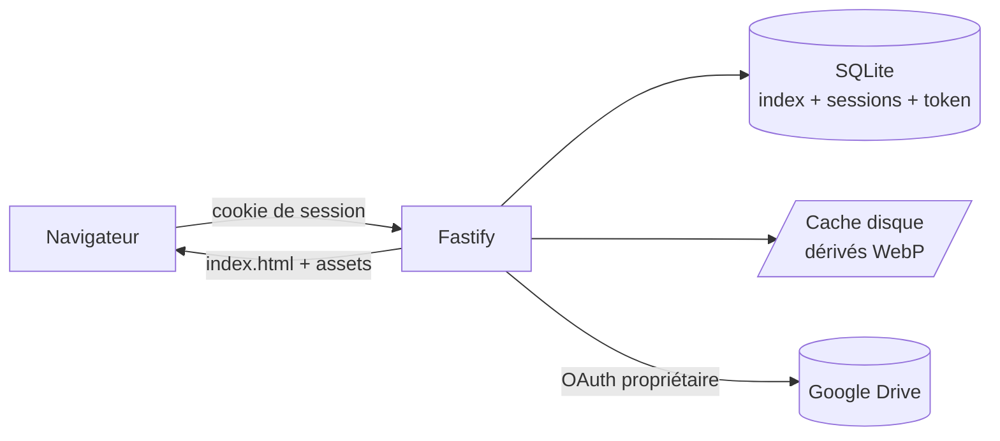
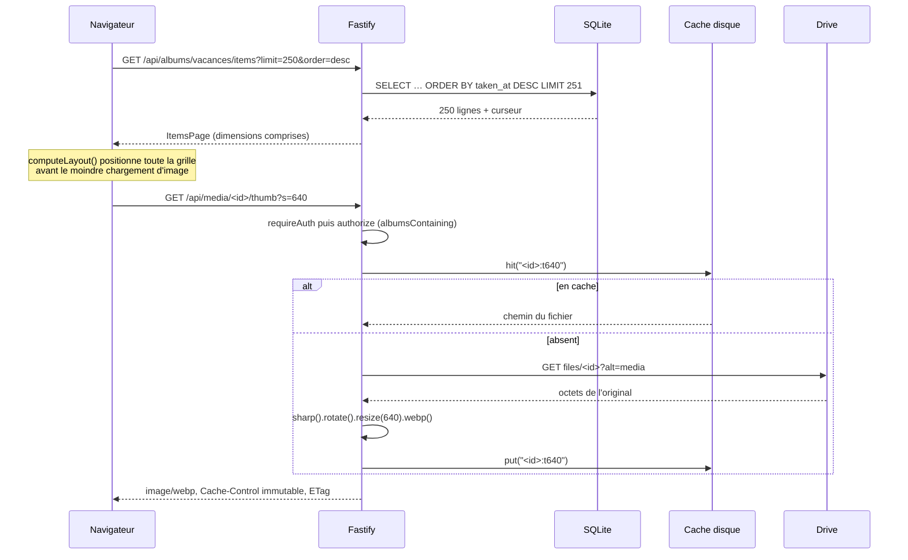

# 02 — Architecture

## Vue d'ensemble

Monorepo pnpm, trois packages, un seul conteneur en production. Le serveur
Fastify sert à la fois l'API sous `/api` et le front buildé sur tout le reste.

| Package           | Rôle                                                                                                                                                                                                                                |
| ----------------- | ----------------------------------------------------------------------------------------------------------------------------------------------------------------------------------------------------------------------------------- |
| `packages/shared` | Types du contrat d'API (`MediaItem`, `Album`, `ItemsPage`, `AdminStatus`…) et les quelques constantes partagées (`THUMB_SIZES`, `SortOrder`). Aucune dépendance, aucune logique. Le front ne redéclare jamais une forme de réponse. |
| `packages/server` | Fastify 5, better-sqlite3, sharp, `@googleapis/drive`. Détient l'index, la connexion Drive, le pipeline média, les sessions.                                                                                                        |
| `packages/web`    | React 19, Vite, Tailwind 4, TanStack Query, React Router. Aucun accès direct à Google.                                                                                                                                              |

### Le serveur, fichier par fichier

| Fichier                  | Responsabilité                                                                                                                                                                  |
| ------------------------ | ------------------------------------------------------------------------------------------------------------------------------------------------------------------------------- |
| `src/main.ts`            | Point d'entrée : `.env`, env, `buildApp`, minuteurs reprogrammables, arrêt gracieux.                                                                                            |
| `src/app.ts`             | Assemblage Fastify : plugins, préfixes de routes, service du front, gestionnaire d'erreurs.                                                                                     |
| `src/env.ts`             | Schéma zod des variables d'environnement, résolution des chemins.                                                                                                               |
| `src/config.ts`          | Schéma zod d'`albums.yaml`, lu au seul amorçage d'une base vide.                                                                                                                |
| `src/bootstrap.ts`       | Import unique d'`albums.yaml` en base, tant qu'aucun compte n'existe.                                                                                                           |
| `src/config-repo.ts`     | `ConfigRepo` : comptes, albums, droits, réglages. Seul écrivain, instantané mémoire.                                                                                            |
| `src/context.ts`         | `AppContext` : objet unique qui porte config, base et services. Les routes n'instancient rien.                                                                                  |
| `src/db.ts`              | Ouverture SQLite, pragmas, tableau `MIGRATIONS`.                                                                                                                                |
| `src/repo.ts`            | Accès aux tables `media` et `sync_state`, curseurs de pagination.                                                                                                               |
| `src/comments.ts`        | `CommentRepo` : fils, profondeur limitée à un niveau, modération.                                                                                                               |
| `src/places.ts`          | `AlbumDayRepo` et `PlacesPass` : journées annotées, agglomération des positions EXIF en grappes.                                                                                |
| `src/geocoder.ts`        | Géocodage inverse Nominatim, cadencé et mis en cache par cellule d'environ un kilomètre.                                                                                        |
| `src/commenters.ts`      | `CommenterRepo` : identités de commentateur, vérification de l'adresse par code, destinataires.                                                                                 |
| `src/mail.ts`            | Transport SMTP, file d'envoi hors requête, composition des emails de notification.                                                                                              |
| `src/sessions.ts`        | Création, lecture, destruction et purge des sessions.                                                                                                                           |
| `src/crypto.ts`          | AES-256-GCM pour le refresh token, comparaison en temps constant.                                                                                                               |
| `src/throttle.ts`        | Backoff progressif des tentatives de connexion, en mémoire.                                                                                                                     |
| `src/drive/service.ts`   | Unique connexion OAuth : consentement, refresh, `files.list`, `fetchFile`, détection de révocation.                                                                             |
| `src/drive/sync.ts`      | Parcours des dossiers et remplissage de l'index.                                                                                                                                |
| `src/drive/metadata.ts`  | Normalisation des champs Drive (types MIME, date EXIF, nombres, coordonnées), et date de prise de vue d'une vidéo.                                                              |
| `src/drive/mp4.ts`       | Lecture de l'en-tête d'un conteneur MP4 par fenêtres : où est le `moov`, quelle date porte son `mvhd`, quel codec porte sa piste image.                                         |
| `src/media/renderer.ts`  | Rendu WebP par sharp, déduplication des rendus concurrents, repli sur la vignette Drive. `prepare` prépare plusieurs variantes en un seul téléchargement, pour le préchauffage. |
| `src/media/cache.ts`     | Cache disque avec inventaire en mémoire et éviction LRU. Deux instances : les dérivés d'images, et le magasin des vidéos préparées.                                             |
| `src/media/transcode.ts` | `VideoTranscoder` et `TranscodePass` : version H.264 des vidéos dont le codec n'est décodé par aucun navigateur courant, une à la fois et en fond.                              |
| `src/media/range.ts`     | Validation du header `Range` avant relais.                                                                                                                                      |
| `src/plugins/auth.ts`    | Résolution de la session à chaque requête, gardes `requireAuth` / `requireAdmin`.                                                                                               |
| `src/plugins/headers.ts` | En-têtes de sécurité posés sur toutes les réponses — voir [04](./04-securite-et-acces.md).                                                                                      |
| `src/routes/*.ts`        | Les quatre familles de routes — voir [05](./05-api.md).                                                                                                                         |

## Cheminement d'une vignette

Du clic sur un album jusqu'à l'octet rendu.

Points qui comptent :

- Le contrôle d'accès est un `preHandler` global sur le préfixe `/media`
  (`routes/media.ts`) : aucune route média ne peut l'oublier.
- La déduplication vit dans `MediaRenderer.inFlight`, indexée par **clé de
  variante** et non par fichier : dix requêtes sur la même vignette ne
  déclenchent qu'un téléchargement, mais dix requêtes réparties sur `s=320` et
  `s=640` du même fichier en déclenchent **deux**. C'est le prix assumé d'un
  chemin de rendu qui ne connaît qu'une variante à la fois.
  `MediaRenderer.prepare` — le chemin du préchauffage — **ne passe pas par
  `inFlight`** : il garantit le téléchargement unique autrement, par une seule
  descente pour toutes les variantes sous une seule place du limiteur.
- **Les rendus de fichiers _différents_ sont bridés** par un limiteur
  (`media/semaphore.ts`), dimensionné à `cpus - 2` et borné entre 2 et 4. La
  place est prise avant le téléchargement, parce que c'est l'original chargé en
  mémoire qui pèse : sans cette limite, vingt-quatre rendus simultanés font
  grimper le processus de plus de 300 Mo. Le débit total est inchangé, c'est la
  mémoire qui est divisée par trois (D32).
- Le décodage se fait **hors du fil principal**, mais sur le pool de fils de
  libuv, partagé avec les lectures de fichiers. D'où `threadpool.ts`, importé en
  premier par `main.ts` : à la taille par défaut de quatre, servir une vignette
  déjà en cache attend deux secondes derrière les rendus en cours.
- L'`ETag` vaut `"<mediaId>-<version>-<variante>"`, la variante étant
  `320`/`640`/`1280`, `full` ou `hd`. Un `If-None-Match` correspondant répond 304
  sans toucher au disque. **Le segment `version` n'est pas décoratif** : c'est
  l'empreinte du contenu, et le dérivé étant servi en `immutable` pendant un an,
  c'est la seule chose qui invalide le cache navigateur quand on remplace un
  fichier Drive sous le même identifiant.
- **Une vidéo a une vignette, jamais de plein écran.** `serveRendered` la rend
  depuis l'aperçu Drive (`render(..., 'poster')`), qui court-circuite le
  téléchargement de l'original : aucun octet de vidéo n'est décodé ici (D92).
  Deux 415 subsistent, précis : `full` ou `hd` sur une vidéo — il n'y a rien à
  agrandir —, et `thumb` sur une vidéo dont `has_thumbnail` vaut 0, Drive n'ayant
  pas d'image à donner. La grille garde alors la tuile sobre, et le badge de
  lecture avec la durée dans tous les cas.

## Cheminement d'une synchronisation

Déclenchée au démarrage (`sync.onStartup`), périodiquement
(`sync.intervalMinutes`), après un consentement OAuth réussi, depuis
`POST /api/admin/resync`, **à la création d'un album**, et **quand son périmètre
Drive change** (`folderId` ou `recursive` modifié : l'index de l'album est alors
purgé puis reconstruit). Les deux derniers passent par `startSync`
(`routes/admin.ts`) — c'est le chemin de « je crée un album et je l'ouvre dans la
foulée », le plus courant à l'installation.

Tous ces déclencheurs passent par `AppContext.syncThenPrewarm` : l'indexation est
suivie du préchauffage des vignettes (D58), puis de la préparation des vidéos
illisibles (D260809b). L'ordre n'est pas neutre — les vignettes font attendre
quelqu'un devant sa grille, un transcodage prépare une vidéo que personne ne
regarde encore.

1. `Syncer.sync(album)` — si une sync du même album tourne déjà **avec la même
   configuration effective** (`folderId` et `recursive`), la promesse en cours
   est renvoyée telle quelle : une resync manuelle ne double jamais le travail.
   Si la configuration a changé entre-temps, une nouvelle sync est enchaînée
   derrière la précédente. Partager la promesse de l'ancienne rendrait à
   l'appelant un travail qui repeuple l'album avec le dossier qu'il vient de
   quitter ; les lancer en parallèle laisserait l'ordre d'arrivée des
   `deleteStale` décider du contenu final.
2. `sync_state` passe à `running`, erreur remise à `null`.
3. Un `seenAt` ISO est figé : c'est l'estampille du passage.
4. Parcours en profondeur depuis `folderId`, avec `visited` contre les cycles et
   un plafond `MAX_FOLDERS = 5000`. `recursive: false` n'empile pas les
   sous-dossiers. Les **raccourcis Drive ne sont pas suivis** : `files.list` ne
   demande pas `shortcutDetails`, si bien qu'un dossier atteignable seulement
   par un raccourci n'est jamais indexé. `visited` sert donc au cas où le même
   dossier est atteint par deux chemins, pas à casser un cycle de raccourcis.
5. `files.list` par pages de 1000, en ne demandant que
   `id, name, mimeType, size, modifiedTime, md5Checksum, hasThumbnail,
imageMediaMetadata, videoMediaMetadata`. **Aucun contenu n'est téléchargé.**
   `hasThumbnail` dit si Drive a produit un aperçu du fichier : c'est ce qui
   permet à une vidéo d'avoir une vignette de grille (D92), et le stocker évite
   d'en redemander une à chaque chargement de page quand il n'y en a pas.
6. `toUpsert` normalise : `classify` écarte tout ce qui n'est ni image ni vidéo,
   `parseExifTime` lit `YYYY:MM:DD HH:MM:SS`, et les dimensions sont inversées
   quand `imageMediaMetadata.rotation` est impair — sinon les portraits
   casseraient la mise en page.
7. **Une vidéo est la seule exception au « aucun contenu n'est téléchargé »** :
   Drive n'expose aucune date de prise de vue pour elle, alors le début de son
   fichier est lu par requêtes `Range` (D97). `drive/mp4.ts` suit la chaîne des
   boîtes de premier niveau depuis l'offset 0 pour atteindre le `moov`, dont le
   `mvhd` porte la date d'enregistrement ; `resolveVideoTakenAt` la confronte à
   l'horodatage du nom du fichier. **La même fenêtre livre le codec de la piste
   image** — `readVideoCodec` descend `moov → trak → mdia → minf → stbl → stsd`
   et retient la première piste dont le `hdlr` vaut `vide` (D260809b) : les deux
   lectures partagent la boîte, donc les séparer doublerait le nombre de
   requêtes pour relire les mêmes octets. Au plus **quatre fenêtres de 64 Ko**
   par vidéo, 2,3 en moyenne sur un import réel, et **aucune** pour une vidéo
   déjà datée dont le `md5` n'a pas bougé **et dont le codec est renseigné** —
   c'est ce que `MediaRepo.fileTakenAt` vérifie avant de lire quoi que ce soit.
   Cette dernière condition est ce qui peuple `video_codec` sans reprise de
   données : les lignes d'avant la migration 14 sont relues une fois, puis
   court-circuitées comme les autres. Un échec de lecture ne fait pas échouer la
   sync : la date retombe sur le nom, puis sur `modifiedTime`, et le codec reste
   `NULL`, donc réessayé.
8. Écriture par lots de 500 dans une transaction. L'album devient consultable
   pendant la sync.
9. `deleteStale(albumId, seenAt)` retire ce qui n'a pas été revu — fichier
   déplacé, supprimé ou mis à la corbeille.
10. `sync_state` passe à `ok`. En cas d'échec, le statut passe à `error` avec le
    message, **mais `lastSyncAt` garde la valeur de la dernière sync réussie** :
    /admin annonce ainsi le dernier passage vraiment complet. Attention à ce que
    cela ne dit **pas** : l'index n'est pas revenu en arrière. Les lots déjà
    écrits sont validés, `deleteStale` n'a pas eu lieu, donc l'index mélange
    l'ancien et le nouveau contenu. Il reste cohérent — tout ce qui a été écrit
    existe bien dans Drive — simplement incomplet (voir [D27](./08-decisions/D27-une-sync-interrompue-laisse-un-index-melange-et-c-est-assume.md)
    ).
11. `syncAll` enchaîne les albums **séquentiellement** pour ménager le quota, et
    s'arrête net sur `DriveRevokedError` — les suivants échoueraient de la même
    façon.

## Cheminement d'une vidéo illisible

Une vidéo HEVC ne se lit ni dans Chrome ni dans Firefox. D79 et D98 lui ont donné
un message honnête et un bouton **Télécharger** ; D260809b la rend lisible, sans lui
retirer sa qualité là où elle se lisait déjà.

**Côté serveur, en fond.** `TranscodePass` est branché au même endroit que le
préchauffage — fin de `syncThenPrewarm`, et ménage horaire de `main.ts` — et
reprend ses gardes : un seul passage à la fois, réglage relu à chaque vidéo,
plafond par passage, arrêt à l'extinction du serveur. Pour chaque vidéo, du plus
récent album au plus ancien :

1. `needsTranscoding(item.videoCodec)` — seuls `hvc1` et `hev1` passent. La règle
   porte sur le codec, jamais sur un poids ou un nombre de fichiers : transcoder
   un `avc1` dépenserait des minutes de processeur à dégrader l'image.
2. Le magasin est consulté sur `playableKey(id, md5)`, qui porte l'empreinte du
   contenu — une vidéo remplacée dans Drive sous le même identifiant est refaite.
3. `VideoTranscoder` télécharge l'original **sur disque** (jamais en mémoire :
   `MediaRenderer` refuse au-delà de 80 Mo, une vidéo en fait couramment 150),
   lance `ffmpeg` reniçé à 15 et sur un seul fil, puis range le résultat par
   `MediaCache.putFile` — un `rename`, pas trente méga-octets chargés pour être
   réécrits. Les temporaires sont effacés même en cas d'échec.
4. Le passage s'arrête quand le magasin atteint 90 % de son budget : à la limite,
   chaque nouvelle vidéo évincerait la plus ancienne, et le passage suivant
   referait ce que celui-ci vient de jeter.

**Côté client, à l'ouverture.** `chooseVideoSource` interroge le navigateur sur
le codec réel — `canPlayType('video/mp4; codecs="hvc1"')` — et non sur le type
nu, auquel tout le monde répond `maybe` (D98). Chrome demande donc
`GET /api/media/:id/playable`, Safari et un iPhone gardent `/original` en pleine
qualité. Tant que la version n'existe pas, `/playable` répond **404**, que la
visionneuse affiche comme « en préparation » avec le bouton Télécharger.

## Les choix structurants, et leur raison

**Index SQLite plutôt qu'appels Drive à la volée.** Une grille de 200 vignettes
qui interrogerait Drive à chaque défilement consommerait le quota et
ajouterait 200 à 400 ms de latence à chaque page. L'index local rend la
pagination instantanée, permet de trier sur la date EXIF (que Drive ne sait pas
trier) et laisse l'application fonctionner en lecture même quand Drive est
injoignable ou l'autorisation révoquée — seuls les rendus non encore en cache
échouent alors.

**Proxy média plutôt que redirection vers Google.** Servir des liens Google
signés serait moins coûteux en bande passante, mais : un lien signé fuit hors du
contrôle d'accès dès qu'il est copié, il expire et casse le cache navigateur, et
il exposerait l'arborescence Drive au visiteur. Tout passe donc par
`/api/media/...`, où chaque requête revérifie l'autorisation.

**Cache disque des dérivés.** Régénérer une vignette coûte un téléchargement
Drive plus un décodage sharp. Le cache est un simple fichier par entrée, clé
`sha256(<fileId>:<md5>:<variante>)` — sans le `<md5>` pour les rares fichiers
que Drive n'empreinte pas — répartie sur 256 sous-dossiers, inventaire des
tailles en mémoire pour décider des évictions sans re-parcourir l'arborescence.
L'inventaire est **reconstruit au démarrage** par `MediaCache.load()` : un
fichier déposé pendant que le serveur tourne est ignoré jusqu'au redémarrage
(c'est le piège du script `seed-demo`).

L'éviction tourne en tâche de fond, sans que l'écriture qui l'a déclenchée
l'attende. Deux précautions y sont indispensables :

- **Chaque candidat est revérifié juste avant sa suppression.** L'ordre est figé
  au début de la passe, mais `rm` rend la main à la boucle d'événements : une
  requête peut servir une entrée entre le tri et sa suppression. Une estampille
  d'accès strictement croissante, portée par chaque entrée, révèle ce cas ;
  l'entrée touchée est épargnée. Sans cela, `createReadStream` recevrait un
  `ENOENT` sur une entrée que `hit()` venait de valider.
- **Un `rm` en échec est journalisé, pas propagé.** Un rejet non géré en tâche de
  fond termine le process Node : toute la galerie tomberait parce qu'un fichier
  de cache n'a pas pu être supprimé (volume en lecture seule, erreur d'E/S).
  L'entrée reste inventoriée, puisque son fichier est toujours là, et la passe
  continue avec les suivantes.

Côté lecture, `MediaRenderer.render()` vérifie que le fichier désigné par
l'inventaire existe encore avant de le rendre ; sinon il refabrique le dérivé.
C'est ce qui couvre « vider le cache » depuis /admin pendant qu'une grille se
charge, et tout ménage manuel sur le volume.

Limite connue, assumée : la revérification a lieu **avant** le `rm`, pas après.
Une requête peut donc valider une entrée pendant qu'une suppression est déjà en
vol et recevoir un `ENOENT` à l'ouverture — de même qu'un `clear()` déclenché
depuis /admin pendant une écriture. Fermer complètement la fenêtre demanderait
des baux ou un compteur de références sur chaque entrée, ce qui coûte plus cher
en complexité permanente qu'une vignette manquante ne coûte à qui la recharge.

**Pas de transcodage vidéo.** `GET /api/media/:id/original` relaie le header
`Range` tel quel vers Drive et recopie `Content-Length` / `Content-Range` de la
réponse. Le seek natif marche, le CPU du VPS ne fait rien, et il n'y a aucun
format intermédiaire à stocker. Les statuts `206` **et `416`** sont relayés :
une plage insatisfaisable fait partie du protocole `Range` normal (offset au-delà
de la fin, courant quand on change de vidéo), et son `Content-Range` dit au
lecteur où s'arrête le fichier. La contrepartie assumée : un format que le
navigateur ne lit pas n'est pas lisible du tout.

**Les lieux d'une journée se déduisent en deux temps.** Une grille datée ne dit
pas ce qu'on a fait ; les photos, elles, portent souvent leur position. Le
passage `places.ts` est branché sur le ménage horaire de `main.ts`, sur le
démarrage **et sur la fin de chaque synchronisation** (`AppContext.syncThenPrewarm`),
exactement comme le préchauffage et pour les mêmes raisons : la synchronisation
peut être désactivée et les lieux attendraient alors indéfiniment (D45), mais
une sync qui vient de verser des photos géolocalisées sait déjà nommer leur
journée, et la laisser muette une heure de plus n'apporte rien (D91). Comme pour
le préchauffage, le démarrage et la sync de démarrage **s'excluent** : lancés
ensemble, celui qui doit suivre la sync se ferait refuser comme passage
concurrent. Le passage tourne en deux moitiés délibérément séparées :

1. **L'agrégation**, déterministe et hors réseau. Pour chaque album,
   `MediaRepo.geolocatedPoints` rend les positions par ordre chronologique ;
   elles sont regroupées par jour UTC, puis agglomérées gloutonnement à ~15 km,
   trois grappes au plus — celles où le plus de photos ont été prises, dans
   l'ordre de leur première photo. Chaque grappe donne une **cellule**
   `lat,lng` arrondie à deux décimales, soit ~1,1 km. Le résultat s'écrit dans
   `album_days.cells`.
2. **Le géocodage**, lent et faillible. `geocoder.ts` ne demande à Nominatim que
   les cellules absentes de `geo_places`, à raison d'une requête toutes les
   1,1 s (politique d'usage) et 200 par passage au plus, le reste attendant
   l'heure suivante. Le cache est partagé entre albums.

Les séparer est ce qui rend le recalcul gratuit : les journées se réécrivent à
chaque passage sans rappeler personne, et les libellés s'allument tout seuls
quand ils arrivent (D48). L'invariant qui compte : le recalcul réécrit `cells`
et **rien d'autre** — `description` et `place` appartiennent à l'administrateur.

Rien de tout cela ne touche au chemin d'une requête : `better-sqlite3` est
synchrone, et géocoder à la volée ferait attendre le lecteur une seconde par
lieu. Le déclenchement par `/admin/resync` n'y déroge pas — la route répond 202
et le passage part détaché, comme le préchauffage. Aucun minuteur n'est armé par
`buildApp`, seulement par `main.ts` ; un test qui appelle `syncThenPrewarm`
remplace en revanche `places` par un espion, sinon il joindrait Nominatim dès
que l'album de test porte une position.

**Le cache se remplit sans attendre qu'on clique.** `media/prewarm.ts` prépare
les **trois tailles de vignette** des photos en fond, des plus récentes aux plus
anciennes. C'est la grille qui fait attendre, et elle ne demande que celles-ci —
laquelle dépend de la largeur de la case et de la densité de l'écran, donc les
trois doivent être prêtes. Le rendu `full` ne vient jamais ici : il pèse une
dizaine de fois une vignette, et le préchargement des voisines dans la
visionneuse couvre déjà le feuilletage (voir D58, qui restreint la portée que
D45 donnait au passage).

Les trois variantes sortent d'**un seul téléchargement** (`MediaRenderer.prepare`),
pour une raison mesurée : produire un dérivé coûte ~2 s de téléchargement Drive
pour ~50 ms de rendu. Trois `render()` enchaînés téléchargeraient trois fois le
même original. Une seule place du limiteur est prise pour l'ensemble — c'est
l'original en mémoire qui pèse, et il est le même pour toutes les variantes.

Le passage est branché sur le ménage horaire, sur le démarrage, **et sur la fin
de chaque synchronisation** (`AppContext.syncThenPrewarm`, par où passent la
sync périodique, celle du démarrage, celle de `/admin` et celle du retour OAuth).
Les deux derniers déclencheurs s'excluent au démarrage : lancés ensemble, le
préchauffage partirait sur l'index d'avant pendant que la sync le remplit, et
celui qui doit suivre la sync se ferait refuser comme passage concurrent — les
photos qui viennent d'arriver, précisément celles qu'on va ouvrir, attendraient
le ménage horaire. Le ménage et le démarrage restent branchés séparément parce
que la synchronisation automatique peut être désactivée. Réglage `prewarmCache`,
relu à chaque photo — **et conditionné à la connexion Drive** : sans elle, le
passage échouerait photo par photo en gardant sa pause d'une seconde, soit un
quart d'heure de boucle stérile par heure sur un album de mille photos (D61). Sa
lenteur est volontaire — voir D45.

**Un téléchargement de contenu a une échéance de 120 s, un relais vidéo non.**
La place du limiteur étant prise **avant** le téléchargement, un `fetch` figé
gèlerait tous les rendus le temps du défaut d'undici — cinq minutes. Les requêtes
porteuses d'un `Range` en sont exclues : c'est une vidéo que le navigateur
consomme à son rythme, et une échéance _totale_ couperait la lecture. Un
dépassement, comme un débit limité au-delà des réessais, lève
`DriveUnavailableError` → **503 + `Retry-After`**, jamais 500 : l'échec est
transitoire, et la vignette le retente d'elle-même (D60).

**Un original de plus de 80 Mo n'est pas décodé sur place.** Le limiteur borne
le nombre de rendus simultanés, pas leur taille, et chaque rendu charge son
original entier en mémoire pour le donner à sharp : ses quatre places au maximum,
prises par des fichiers de 300 Mo, suffisent à emporter le processus, donc la
galerie — et deux suffisent déjà sur un VPS bicœur. La taille
annoncée par Drive est donc contrôlée **avant** de lire le corps, et le corps
mesuré à son tour — un en-tête absent ou menteur ne doit pas suffire. Au-delà,
la photo n'est pas refusée : elle emprunte le repli ci-dessous.

**Le repli Drive est authentifié.** Quand libvips ne décode pas un HEIC ou un
RAW, ou quand l'original est trop lourd, le rendu repart du `thumbnailLink`
produit par Google. Ce lien porte le même
contrôle d'accès que le fichier : demandé sans en-tête `Authorization`, il répond
401/403 pour tout fichier non public — c'est-à-dire dans le cas normal. Il passe
donc par `DriveService.fetchAuthorized()`, comme les téléchargements d'originaux,
avec le même renouvellement de jeton sur 401.

**Un seul conteneur.** Le front buildé est servi par `@fastify/static` depuis le
même process. Une seule origine, donc des cookies de session simples, aucun CORS,
aucun reverse-proxy interne à configurer.

En production, un second conteneur l'accompagne : **Caddy**, qui termine le TLS
et relaie vers `app:8080`. L'application ne publie aucun port sur l'hôte. Ce
n'est pas une exception au paragraphe précédent — Caddy ne connaît rien de
l'application, il n'y a toujours qu'une origine et qu'un process applicatif —
c'est le TLS et le renouvellement de certificat sortis du code (D47).
